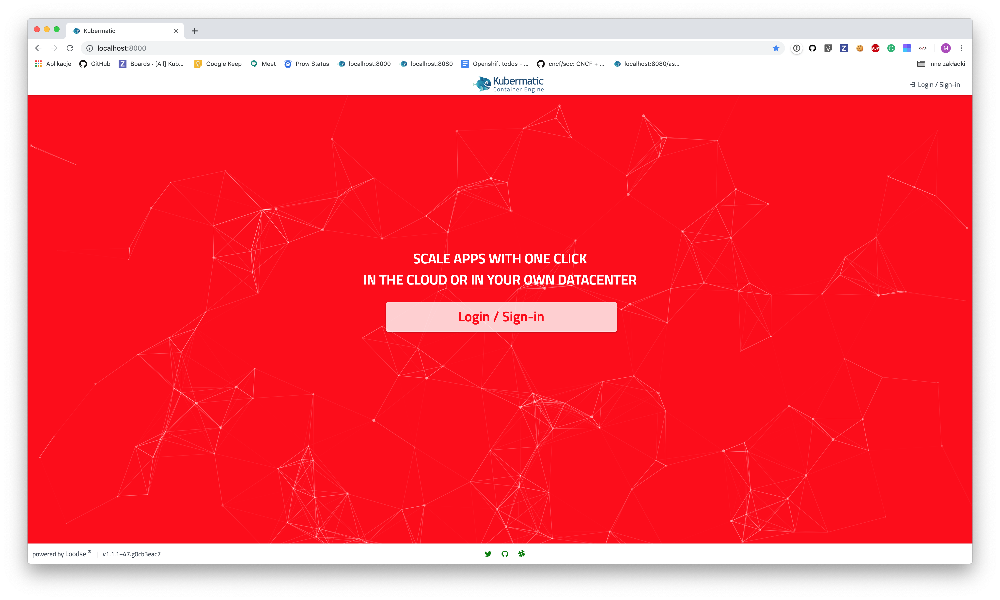

# Customizing the Application
This manual explains how to apply custom theme to the app. As we are using SCSS that needs to be processed into the
CSS during the build, there are two different approaches to it:

- In the first approach user, that would like to customize the app has the access to the source files (possibly a
repository fork) and is able to use all the benefits of the SCSS and rules that are already defined.
- Second approach is destined for users, that don't have a access to the source files and are not able to use SCSS.
In that case user needs to write CSS rules from scratch and apply them using mount.

## Using SCSS
All the application-wide rules are stored inside `src/assets/css` directory, where `_main.scss` is the main file that
imports all other files that are required. The recommended approach to override application's default styling is to
register your own CSS files inside `_main.scss` and override existing CSS files if it is needed. Overriding existing
files is most valuable when for example color variables need to be changed application-wide.

After applying all the required changes you can simply build a new container image and deploy it to your cluster.

### Example
Let's override the default application theme and change the primary color to red and social link icons color to green.

First, we need to find out what changes are needed.

To change application primary color to red we need to modify `_colors.scss`:

```scss
$primary: red;

...
```

To change social link icons color to green we will add a custom theme file named `custom.scss` with the following
contents:

```scss
.km-footer-nav .km-social i {
  color: green;
}
```

To register this file we will need to import it in the [`_main.scss`](../assets/customizing/_main.scss) file:

```scss
...

// Load custom theme.
@import "custom";
```

Now, having all the changes prepared let's build a container image and deploy it to the cluster.

The result of this example should look like this:



## Using CSS 

Let's override the default application theme and change the primary color to red and social link icons color to green.

First, we need to find out what changes are needed.


### Example
...

In the example we will use single Docker container, but it can be applied to the container running
inside the Kubernetes' cluster.

...

Assuming that we have already built an image named `kubermatic/ui-v2:custom` we can run it using
following command to mount our customizations into it:

```
docker run --rm -ti -v $(pwd)/docs/assets/customizing/style.css:/dist/assets/custom/style.css \
--user=$(id -u) -p 8080:8080 quay.io/kubermatic/ui-v2:test
```

...

## Tips

- If you are maintaining your work it is better to keep your custom changes in a separate file to avoid potential
conflicts.
- The order of imports is important. It is better to import your own customizations at the end of the file to make
them more important than the default application style.
- You can view assets from already running application by accessing `http://<host>>:<port>>/assets/<file>`.
