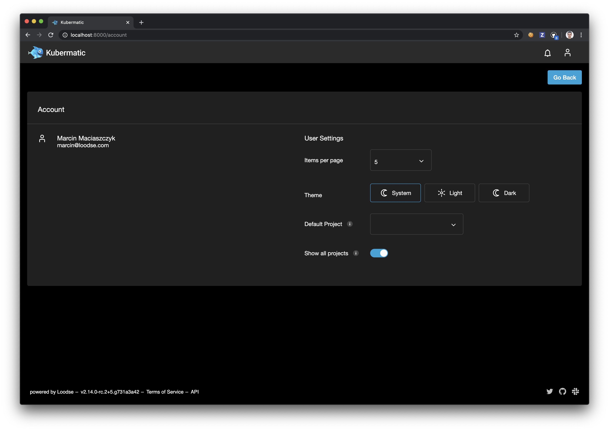

# Customizing the Application
This manual explains multiple approaches to adding custom themes to the application.

## Modifying Available Themes
Currently the application has two themes by default, light and dark. Each user can specify theme that we want to use
in the `Account` view which is accessible from the user menu:



### Changing Available Themes
To add a new theme complete following steps:

- Prepare theme specification, look at `src/assets/css/_dark.scss` and `src/assets/css/_dark.scss` for the examples.
- Import theme specification in the `src/assets/css/main.scss`.
- Add theme to `Theme` enum in `src/app/shared/entity/MemberEntity.ts`.
- Add theme option to `src/app/settings/user/user-settings.component.html`.

In order to delete theme do the opposite in each step.

### Choosing Default Theme
The default theme is defined in the following locations:

- `src/app/core/services/settings/settings.service.ts`
- `src/app/kubermatic.component.ts`
- `src/index.html`

**Tip**: Consistency needs to be ensured here to avoid any potential issues.

### Disabling Theming Functionality
In order to disable theming options for the user and enforce using only the default theme for all of the users set
`disable_themes` property to `true` in the application config.
 
## Possible Customizing Approaches
There are a few possible options to customize the application codebase. 
 
### Changing Application Sources
This is the most obvious approach. However, it requires access to the repository as some of the sources need changes.
Its biggest advantage is possibility to reuse code that are already defined.

All the application-wide rules are stored inside `src/assets/css` directory, where `main.scss` is the main file that
imports all other files that are required. The recommended approach to override application default styling is to
register custom stylesheets inside `main.scss` and override existing stylesheets only if it is required. Overriding
existing files is required when for example color variables need to be changed application-wide.

After applying all the required changes, a new container can be build and deployed into the cluster.

**Tip**: It is easier to avoid merge conflicts and maintain rules stored inside separate files that will be only
imported inside the application sources.

**Tip**: The order of imports is important. It is better to keep customizations at the end of the file to make them
more important than the default application style.

### Example
Let's override the default application theme and change the primary color to red and social link icons color to green.

First, we need to find out what changes are needed.

To change application primary color to red we need to modify `_theme.scss`:

```scss
$primary: red;

...
```

To change social link icons color to green we will add a custom theme file named `custom.scss` with the following
contents:

```scss
.km-footer i {
  filter: sepia(100%) contrast(50%) saturate(500%) hue-rotate(410deg) !important;
}
```

To register this file we will need to import it in the `main.scss` file:

```scss
...

// Load custom theme.
@import "custom";
```

Now, having all the changes prepared let's build a container image and deploy it to the cluster.

The result of this example should look like this:


### Customizing the Application Sources inside Custom Container
This approach is very similar to the first one, but this time application sources can be changed inside the custom
container that was prepared specially for it. It allows to modify stylesheets just like in the first approach, but files
could be easily mounted into existing custom container, so there is no need to build another image.

Custom image is defined inside `Dockerfile.custom` and should be kept inside `quay.io/kubermatic/ui-v2-custom`
repository.

### Customizing the Application Without Changing the Sources
This approach is recommended for those who cannot or do not want to modify application sources. It does not require
access to the sources, as all customizations will be applied as CSS rules written from the scratch that will be mounted
into the application container.

Custom CSS file needs to be mounted as specified in `environment.prod.ts`, so as `dist/assets/custom/style.css`.
Assuming that we have application image `kubermatic/ui-v2:test` that we want to customize and CSS file named `c.css`
we can run following command to start application and apply custom CSS rules:

```
docker run --rm -ti -v $(pwd)/c.css:/dist/assets/custom/style.css --user=$(id -u) -p 8080:8080 kubermatic/ui-v2:test
```

**Tip**: Custom CSS file can be used as a root file that will import other custom files.

**Tip**: Assets from an already running application can be viewed by accessing `http://<host>>:<port>>/assets/<file>`.
For example: `http://localhost:8080/assets/custom/style.css`.

### Example
Like in the example to the first approach, let's override the default application theme and change the social link
icons color to green.

It is easiest to start with running the container with customizations file mounted to it:
```
docker run --rm -ti -v $(pwd)/c.css:/dist/assets/custom/style.css --user=$(id -u) -p 8080:8080 kubermatic/ui-v2:test
```

Then we can apply customizations to the `$(pwd)/c.css` file:

```css
.km-footer i {
  filter: sepia(100%) contrast(50%) saturate(500%) hue-rotate(410deg) !important;
}
```

The result of this example should look the same as in the example to the first approach.
