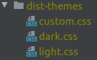
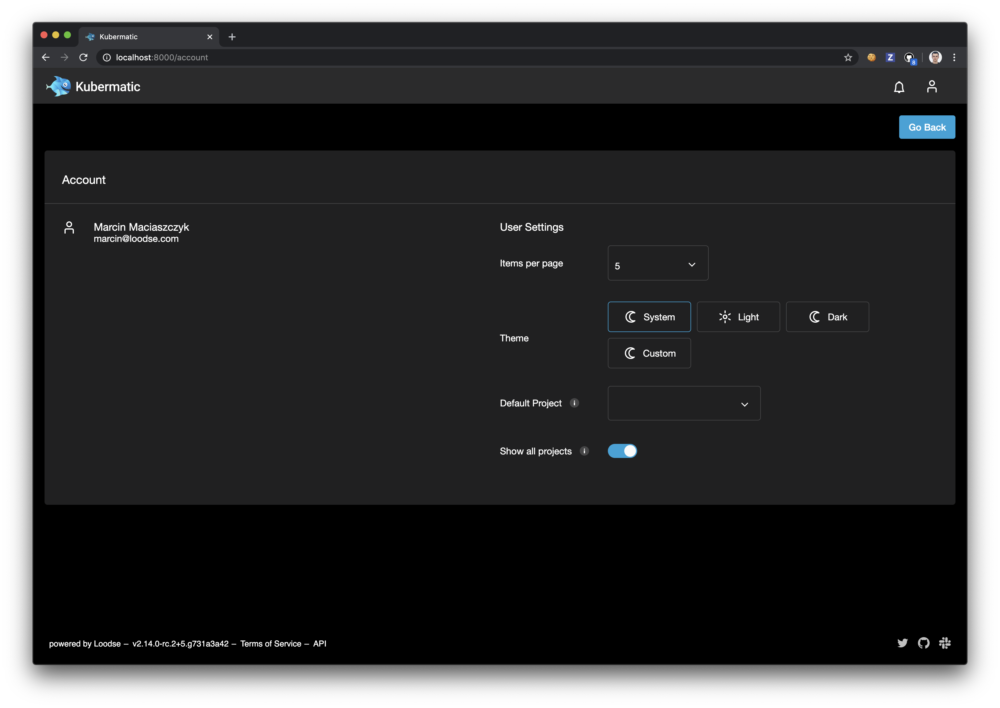
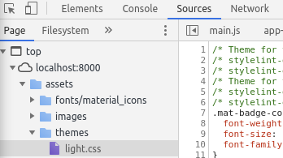

# Customizing the Application

This manual explains multiple approaches to adding custom themes to the application.

## Modifying Available Themes

Currently, the application offers two themes by default, light and dark. There is also an option to choose system theme and let the application choose dark/light theme based
on the user's operating system theme. Each user can specify a theme to use in the `Account` view which is accessible from the user menu under `User Settings`:


### Disabling Theming Functionality

In order to disable theming options for all users and enforce using only the default theme, set
`enforced_theme` property in the application `config.json` file to the name of the theme that should be enforced (i.e. `light`).

## Possible Customizing Approaches

There are two possible approaches of preparing custom themes. They all rely on the same functionality. It all depends on user access to the application code in order
to prepare and quickly test the new theme before using it in the official deployment.

### Preparing a New Theme With Access to the Sources

This approach gives user the possibility to reuse already defined code, work with `scss` instead of `css`
and quickly test your new theme before uploading it to the official deployment.

All available themes can be found inside `src/assets/themes` directory. Follow the below steps to prepare a new custom theme:

- Create a new `scss` theme file inside `src/assets/themes` directory called `custom.scss`. This is only a temporary name that can be changed later.
- As a base reuse code from one of the default themes, either `light.scss` or `dark.scss`.
- Register a new style in `src/assets/config/config.json` similar to how it's done for `light` and `dark` themes. As the `name` use `custom`.
  - `name` - refers to the theme file name stored inside `assets/themes` directory.
  - `displayName` - will be used by the theme picker available in the `Account` view to display a new theme.
  - `isDark` - defines the icon to be used by the theme picker (sun/moon).

    ```json
    {
      "openstack": {
        "wizard_use_default_user": false
      },
      "share_kubeconfig": false,
      "themes": [
        {
          "name": "custom",
          "displayName": "Custom",
          "isDark": false
        }
      ]
    }
    ```

- Run the application using `npm start`, open the `Account` view under `User settings`, select your new theme and update `custom.scss` according to your needs.
  It is possible to override basically everything inside this theme file. In example if you want to change background color of a `mat-form-field` do this:

  ```scss
  .mat-form-field {
    background-color: red;
  }
  ```

  **TIP:** As currently selected theme name is saved inside user settings, change it back to one of the default themes before uploading your theme to the official deployment.
- Once your new theme is ready run `npm run build:themes`. It should create a `dist-themes` directory inside Kubermatic Dashboard directory with compiled `css` files of all themes
  stored inside `src/assets/themes` directory. Now you can rename your `custom.css` theme file to some other name, i.e. `solar.css`.

  

- Now, simply update your `config.json` file used by `Kubermatic Dashboard` Deployment and register the new theme same as it was done earlier.
  Make sure that `name` entry corresponds to the name of your theme file (without the `css` suffix).
- As the last step, mount your custom CSS theme file to the `dist/assets/themes` directory. Make sure not to override whole directory as default themes are required by the application.
- After application restart, theme picker should show your new theme.



### Preparing a New Theme Without Access to the Sources

In this case the easiest way of preparing a new theme is to download one of the existing themes light/dark. This can be done in a few different ways.
We'll describe here two possible ways of downloading enabled themes.

#### Download Theme Using the Browser

1. Open Kubermatic UI
2. Open `Developer tools` and navigate to `Sources` tab.
3. There should be a CSS file of a currently selected theme available to be downloaded inside `assts/themes` directory.

   

#### Download Themes Directly From the Kubermatic Dashboard container

Assuming that you know how to exec into the container and copy resources from/to it, themes can be simply copied over to your machine
from the running Kubermatic Dashboard container. They are stored inside the container in `dist/assets/themes` directory.

##### Kubernetes

Assuming that the Kubermatic Dashboard pod name is `kubermatic-dashboard-5b96d7f5df-mkmgh` you can copy themes to your `${HOME}/themes` directory using below command:

```bash
kubectl -n kubermatic cp kubermatic-dashboard-5b96d7f5df-mkmgh:/dist/assets/themes ~/themes
```

##### Docker

Assuming that the Kubermatic Dashboard container name is `kubermatic-dashboard` you can copy themes to your `${HOME}/themes` directory using below command:

```bash
docker cp kubermatic-dashboard:/dist/assets/themes/. ~/themes
```

#### Using Compiled Theme to Prepare a New Theme

Once you have a base theme file ready, we can use it to prepare a new theme. To easier understand the process, let's
assume that we have downloaded a `light.css` file and will be preparing a new theme called `solar.css`.

1. Rename `light.css` to `solar.css`.
2. Update `solar.css` file according to your needs. Anything in the file can be changed or new rules can be added.
   In case you are changing colors, remember to update it in the whole file.
3. Mount new `solar.css` file to `dist/assets/themes` directory inside the application container. **Make sure not to override whole directory.**
4. Update `config.json` file inside `dist/config` directory and register the new theme.

    ```json
    {
      "openstack": {
        "wizard_use_default_user": false
      },
      "share_kubeconfig": false,
      "themes": [
        {
          "name": "solar",
          "displayName": "Solar",
          "isDark": true
        }
      ]
    }
    ```

That's it. After restarting the application, theme picker in the `Account` view should show your new `Solar` theme.
